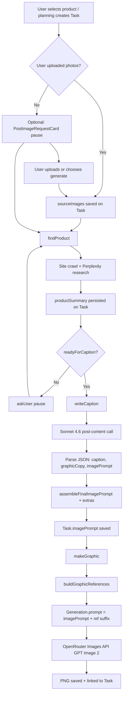

# Image Prompt Architecture

Design report for Brewline Content Studio’s AI social media graphics pipeline.  
**No code was modified** — this document reflects the codebase as analyzed on 2026-06-30.

---

## Table of Contents

1. [LLM Flow (End-to-End Pipeline)](#1-llm-flow-end-to-end-pipeline)
2. [Prompt Assembly (Files & Functions)](#2-prompt-assembly-files--functions)
3. [Image Prompt Assembly (`Generation.prompt`)](#3-image-prompt-assembly-generationprompt)
4. [Prompt Size Estimates](#4-prompt-size-estimates)
5. [Static vs Dynamic Content](#5-static-vs-dynamic-content)
6. [Refactor Readiness](#6-refactor-readiness)
7. [Key Models & Storage](#7-key-models--storage)

---

## 1. LLM Flow (End-to-End Pipeline)

The pipeline is orchestrated by the **post agent** (`lib/ai/agents/postAgent.ts`), which runs as a background job (`RUN_TASK_AGENT` in `lib/queue/handlers.ts`). Each post is a `Task` row.



### Step-by-step

| Step | What happens | Key code |
|------|----------------|----------|
| **1. Product selection** | User plans posts in chat; planning tools create `Task` rows with `productInfo.name`, `subject`, and `title`. User may attach product photos via `PostImageRequestCard` → `prepareTaskImageSubmit` stores `sourceImages`. | `lib/ai/agents/planningTools.ts`, `lib/ai/agents/postImageRequest.ts`, `lib/ai/agents/productAgent.ts` |
| **2. findProduct** | Post agent calls `findProduct(taskId, productName)`. If user already uploaded photos, research runs with those images as primary. Otherwise crawls client site for product pages. | `lib/ai/agents/productAgent.ts` → `findProduct` / `findProductInner` |
| **3. Perplexity research** | `finalizeSummary` → `enrichProductMarketingBrief` → `runProductWebResearch` calls **Perplexity Sonar** (`MODELS.research`) via OpenRouter. Raw notes saved as `productSummary.webResearchNotes`. Also merges past captions, copy snippets, brand kit product notes, and user notes as research hints. | `lib/ai/research/marketingBrief.ts`, `productAgent.resolveProductResearchHints` |
| **4. Brand context retrieval** | Brand kit loaded from project store. For research: `buildClientResearchContext`. For Sonnet: `formatBrandKitForPostContentPrompt`. For image scaffold: `assembleImageBrandScaffold` (full narrative, colors, preferences). | `lib/brandKit/store.ts`, `lib/brandKit/formatForPrompt.ts`, `lib/brandKit/clientResearchContext.ts` |
| **5. Old approved content** | **Caption corpus** (`project.captionCorpus`) formatted for Sonnet style guidance. **Content references** (caption examples, copy snippets, style graphics) resolved per task. Style refs go to Sonnet user prompt; graphic style notes also appended to image prompt extras. | `lib/content/captionCorpus.ts`, `lib/content/references.ts` |
| **6. writeCaption → Sonnet API** | Single OpenRouter chat call to **Claude Sonnet 4.6** (`MODELS.caption`). System + user messages built in `generatePostContentForTask`. Returns JSON: `{ caption, graphicCopy, imagePrompt }`. | `lib/ai/postContent.ts` → `openRouterChatJSON` in `lib/ai/openrouter.ts` |
| **7. Sonnet response parsing** | `normalizePostContentPayload` handles alternate keys / batched arrays. `isCompletePostContent` validates. One repair retry with `REPAIR_SUFFIX` if incomplete. `sanitizeGraphicCopy` normalizes dashes. | `lib/ai/normalizePostContent.ts`, `lib/ai/generationRules.ts` |
| **8. imagePrompt creation** | Sonnet’s `imagePrompt` field = **creative scene only** (2–4 sentences). Code calls `assembleFinalImagePrompt({ creativeScene, kit, graphicCopy, productDescription, context })` → creative scene + brand scaffold. | `lib/ai/postContent.ts`, `lib/brandKit/formatForPrompt.ts` |
| **9. App appends additional content** | `appendImagePromptExtras` adds upload-photo hints, vision `visualContext`, user product notes, and style reference summaries. Result saved to `Task.imagePrompt`. | `lib/ai/imagePromptExtras.ts` |
| **10. makeGraphic** | Reads `task.imagePrompt`. `buildGraphicReferences` resolves product/logo/style images to base64 data URLs and builds `promptSuffix`. Final text: `imagePrompt + promptSuffix`. | `lib/ai/agents/graphicAgent.ts`, `lib/ai/graphicReferences.ts`, `lib/ai/buildImageRefs.ts` |
| **11. Final prompt → image model** | `Generation.prompt` saved. `OpenRouterImageProvider.generate({ prompt, referenceImageUrls })` POSTs to `https://openrouter.ai/api/v1/images` with model **`openai/gpt-image-2`** (`MODELS.image`). Images attached as `input_references`. | `lib/ai/providers/openRouterImageProvider.ts` |

### Pause / resume paths

- **needsDescription**: Perplexity + site research insufficient → `askUser` → user replies → `applyUserProductDescription` → resume.
- **noUsableImage**: Product info OK but no site photo → image request card → upload or “generate”.
- **Research checkpoint**: If agent state shows `findProduct` with `readyForCaption`, `finishPostFromResearchCheckpoint` skips the agent and calls `writeCaption` + `makeGraphic` directly (`lib/ai/agents/postCheckpoint.ts`).

---

## 2. Prompt Assembly (Files & Functions)

### Sonnet system prompt

| File | Function / constant | Purpose |
|------|---------------------|---------|
| `lib/ai/postContent.ts` | `POST_CONTENT_SYSTEM_PROMPT` | Core instructions: JSON output schema, post-topic rules, caption rules, graphic copy rules, **creative-only** image prompt rules. |
| `lib/ai/postContent.ts` | `POST_TOPIC_RULES` | Ensures copy is about the single POST TOPIC product only. |
| `lib/ai/generationRules.ts` | `CAPTION_UNIVERSAL_RULES` | Injected into brand context block used by Sonnet user prompt (via `formatBrandKitForPostContentPrompt`). |
| `lib/ai/generationRules.ts` | `GRAPHIC_COPY_SYSTEM_RULES` | On-graphic copy constraints in Sonnet system prompt. |
| `lib/content/captionCorpus.ts` | `hashtagGuidanceFromCorpus(corpus)` | Appended to Sonnet system prompt when past captions exist. |
| `lib/ai/postContent.ts` | `generatePostContentForTask` | Assembles final system string: `` `${POST_CONTENT_SYSTEM_PROMPT}\n\n${hashtagGuidanceFromCorpus(corpus)}` `` |

### Sonnet user prompt

| File | Function | Purpose |
|------|----------|---------|
| `lib/ai/postContent.ts` | `generatePostContentForTask` | Joins all user-message blocks (see order below). |
| `lib/ai/productContext.ts` | `formatProductInfoForPrompt` | Product name + Perplexity/site/user research text (`getProductInfoForCaption`). |
| `lib/ai/productContext.ts` | `formatVisualContextForPrompt` | Vision-derived product appearance (graphic grounding, not caption). |
| `lib/brandKit/formatForPrompt.ts` | `formatBrandKitForPostContentPrompt` | Slim brand block: business, tone, audience, preferences, product notes, caption rules. |
| `lib/ai/productContext.ts` | `formatUserProductNotesForPrompt` | Per-post user notes from Task. |
| `lib/ai/postContent.ts` | (inline `uploadedPhotoHint`) | Tells Sonnet to align copy/scene with uploaded photos. |
| `lib/content/captionCorpus.ts` | `formatCaptionCorpusForPrompt` | Past approved captions as style reference (not verbatim copy). |
| `lib/content/references.ts` | `formatReferencesForGraphicPrompt` | Style graphic summaries for Sonnet (layout/mood inspiration). |
| `lib/brandKit/formatForPrompt.ts` | `resolveBrandKitForTask` | Loads brand kit for the task’s project. |
| `lib/brandKit/preferences.ts` | `resolvePreferenceContextFromTask` | Scopes client/product preferences to current product name. |

**Sonnet user prompt block order** (joined with `\n\n`):

1. Product info (Perplexity research or site/user description)  
2. Visual context (if any)  
3. Client background (brand kit — not the post topic)  
4. User-provided detail for this post  
5. Uploaded photo hint (if any)  
6. Past caption corpus  
7. Style reference summaries  
8. `POST TOPIC: {productName}`  
9. Closing instruction to write caption, graphicCopy, and imagePrompt together  

### Parsing Sonnet response

| File | Function | Purpose |
|------|----------|---------|
| `lib/ai/openrouter.ts` | `openRouterChatJSON` | Calls OpenRouter chat completions; extracts JSON from model text. |
| `lib/ai/normalizePostContent.ts` | `normalizePostContentPayload` | Maps alternate field names; picks best item from arrays. |
| `lib/ai/normalizePostContent.ts` | `isCompletePostContent` | Validates required fields before save. |
| `lib/ai/generationRules.ts` | `sanitizeGraphicCopy` | Cleans em/en dashes in graphic copy strings. |

### Appending brand scaffold (image model text)

| File | Function | Purpose |
|------|----------|---------|
| `lib/brandKit/formatForPrompt.ts` | `assembleFinalImagePrompt` | `creativeScene + "\n\n" + assembleImageBrandScaffold(...)`. |
| `lib/brandKit/formatForPrompt.ts` | `assembleImageBrandScaffold` | Full deterministic scaffold: format, narrative, colors, avoid colors, theme, tone, preferences, product notes, **THIS DESIGN IS FOR** (full research brief), quoted on-graphic copy, contact line, RULES. |
| `lib/brandKit/formatForPrompt.ts` | `formatColorsForImagePrompt` | `name hex` color list for image prompt. |
| `lib/brandKit/businessSummaryNarrative.ts` | `resolveBusinessSummaryNarrative` | Long-form brand narrative in scaffold. |
| `lib/ai/generationRules.ts` | `IMAGE_PROMPT_UNIVERSAL_RULES` | Bullet rules appended under scaffold RULES section. |

### Appending client preferences

| File | Function | Purpose |
|------|----------|---------|
| `lib/brandKit/preferences.ts` | `formatPreferencesForPrompt` | Filtered `CLIENT PREFERENCES (must follow)` block in brand scaffold. |
| `lib/brandKit/preferences.ts` | `formatProductNotesForPrompt` | `PRODUCT NOTES for {product}` in scaffold. |
| `lib/brandKit/preferences.ts` | `filterPreferencesForContext` | Client-wide + confident product/topic scoped entries only. |

### Appending Perplexity research (to image prompt)

| File | Function | Purpose |
|------|----------|---------|
| `lib/ai/productContext.ts` | `requireMarketingCopyContext` / `getProductInfoForCaption` | Selects `webResearchNotes` when Perplexity succeeded. |
| `lib/brandKit/formatForPrompt.ts` | `assembleImageBrandScaffold` | Embeds full brief under `THIS DESIGN IS FOR: {productDescription}` — **entire Perplexity notes can land here**, not a summary. |

> **Note:** Perplexity research is sent to **Sonnet** (condensed in user prompt) and again to the **image model** (full brief in scaffold). This is a major source of prompt bloat.

### Appending graphic copy

| File | Function | Purpose |
|------|----------|---------|
| `lib/ai/postContent.ts` | `generatePostContentForTask` | Sonnet generates `graphicCopy`; code passes it to scaffold. |
| `lib/brandKit/formatForPrompt.ts` | `assembleImageBrandScaffold` | Renders quoted headline, subheadline, optional bullet, CTA, and contact with exact strings and styling hints. |

### Appending uploaded image references (text + binary)

| File | Function | Purpose |
|------|----------|---------|
| `lib/ai/imagePromptExtras.ts` | `appendImagePromptExtras` | Text: “User provided N product photos…” at **writeCaption** time (saved on `Task.imagePrompt`). |
| `lib/ai/graphicReferences.ts` | `buildGraphicReferences` | Resolves blob URLs → base64; builds `promptSuffix`. |
| `lib/ai/buildImageRefs.ts` | `buildReferenceUrlList` | Orders refs: product → extras → style → logo. |
| `lib/ai/buildImageRefs.ts` | `capReferenceEntries` | Caps at `MAX_IMAGE_REFS` (10); reserves logo slot. |
| `lib/ai/buildImageRefs.ts` | `buildReferencePromptSuffix` | Labels `Image 1 = product photo`, logo rules, multi-photo collage rules, style-ref disclaimer. |
| `lib/content/references.ts` | `getStyleReferenceImageUrls` | Resolves style reference image blobs for attachment. |

### Sending final prompt to image model

| File | Function | Purpose |
|------|----------|---------|
| `lib/ai/agents/graphicAgent.ts` | `makeGraphicForTaskInner` | `prompt = imagePrompt + promptSuffix`; creates/updates `Generation`; calls provider. |
| `lib/ai/imageProvider.ts` | `getImageProvider` | Returns singleton `OpenRouterImageProvider`. |
| `lib/ai/providers/openRouterImageProvider.ts` | `generate` | POST prompt + `input_references` to OpenRouter Images API. |

### Legacy / fallback paths

| File | Function | Purpose |
|------|----------|---------|
| `lib/ai/agents/promptRefiner.ts` | `generateImagePrompt` | If `Task.imagePrompt` missing at graphic time: builds scaffold with **default** creative scene (no Sonnet scene). |
| `lib/ai/agents/promptRefiner.ts` | `assembleImagePromptSkeleton` | Default creative scene + scaffold (used by legacy fallback and full regenerate). |
| `lib/ai/agents/imageAgent.ts` | `regenerateImage` / `editImage` | Feedback loop: minor edits use `provider.edit`; full regenerate rebuilds skeleton + user changes + refs. |

### Perplexity research (upstream, not Sonnet/image assembly)

| File | Function | Purpose |
|------|----------|---------|
| `lib/ai/research/marketingBrief.ts` | `enrichProductMarketingBrief` | Orchestrates search + fallback to site description. |
| `lib/ai/research/marketingBrief.ts` | `runProductWebResearch` | Perplexity Sonar call with `PRODUCT_RESEARCH_RULES`. |
| `lib/ai/agents/productAgent.ts` | `finalizeSummary` | Persists enriched `productSummary` on Task. |

---

## 3. Image Prompt Assembly (`Generation.prompt`)

### What Sonnet writes

From `POST_CONTENT_SYSTEM_PROMPT` in `lib/ai/postContent.ts`:

> **IMAGE PROMPT (creative scene only — 2–4 sentences):**  
> Describe background, mood, layout, and product arrangement for THIS specific post.  
> **Do NOT** include hex color codes, contact phone numbers, brand rules, or exact on-graphic copy — the app appends those deterministically.

Example (Post 5, Cosco Sporlan):

```
Flat-lay or angled product arrangement of Sporlan TXVs, solenoid valves, and filter driers
on a clean dark slate... Layout is landscape-oriented with the product stack left-of-center,
leaving clean space on the right for headline text overlay.
```

Stored as the prefix of `Task.imagePrompt` (everything before `BRAND SCAFFOLD`).

### What the app appends afterward (order)

```
┌─────────────────────────────────────────────────────────────┐
│ 1. CREATIVE SCENE          ← Sonnet imagePrompt field       │
├─────────────────────────────────────────────────────────────┤
│ 2. BRAND SCAFFOLD          ← assembleImageBrandScaffold     │
│    • Format / aspect ratio / business identity              │
│    • BRAND CONTEXT (narrative)                              │
│    • Colors to use / DO NOT use                             │
│    • Theme, tone                                            │
│    • CLIENT PREFERENCES                                     │
│    • PRODUCT NOTES (scoped)                                 │
│    • THIS DESIGN IS FOR: {full marketing/Perplexity brief}  │
│    • ON-GRAPHIC TEXT (quoted headline, subheadline, etc.)   │
│    • RULES (+ IMAGE_PROMPT_UNIVERSAL_RULES)                │
├─────────────────────────────────────────────────────────────┤
│ 3. EXTRAS                  ← appendImagePromptExtras        │
│    • User uploaded N product photos hint                    │
│    • Visual reference (vision)                              │
│    • POST-SPECIFIC USER NOTES                               │
│    • STYLE INSPIRATION (text summaries of style refs)       │
└─────────────────────────────────────────────────────────────┘
         ↓ saved as Task.imagePrompt
┌─────────────────────────────────────────────────────────────┐
│ 4. REFERENCE SUFFIX        ← buildReferencePromptSuffix     │
│    • Reference images: Image 1 = …; Image 2 = …             │
│    • Use product photo(s) EXACTLY as provided                 │
│    • Multi-photo collage rules (if applicable)              │
│    • Use brand logo EXACTLY as provided                       │
│    • Style reference disclaimer OR logo fallback text       │
└─────────────────────────────────────────────────────────────┘
         ↓ saved as Generation.prompt → sent to GPT Image 2
```

Plus **binary reference images** attached separately as `input_references` (not in the text prompt).

### Why this split

| Layer | Owner | Rationale |
|-------|--------|-----------|
| Creative scene | Sonnet | Per-post variation: layout, mood, seasonal cues, composition around uploaded photos. |
| Brand scaffold | Code | **Deterministic** exact copy strings, hex colors, contact styling, and rules — prevents LLM drift on legally/branding-sensitive text. |
| Full research brief in scaffold | Code | Gives image model product context; currently duplicates Perplexity output verbatim. |
| Extras | Code | Grounding for uploads/vision/notes that may not be in Sonnet’s creative scene. |
| Reference suffix | Code at graphic time | Tied to **which images actually attached** (logo omitted if cap exceeded, multi-photo count, etc.). |

### Storage mapping

| Field | Contents |
|-------|----------|
| `Task.caption` | Sonnet caption |
| `Task.graphicCopy` | Sonnet graphic copy JSON |
| `Task.imagePrompt` | Creative scene + scaffold + extras (**no** reference suffix) |
| `Generation.prompt` | `Task.imagePrompt` + reference suffix (exact text to image API) |

---

## 4. Prompt Size Estimates

Estimates from exported Cosco Hawaii production prompts (`generated/cosco-image-prompts.json`, 11 posts with data). Token estimate: `⌈characters / 4⌉` (rough GPT-style approximation).

### Typical post sent to image model

| Section | Words (approx.) | Tokens (approx.) | % of total |
|---------|-----------------|------------------|------------|
| **Creative Scene** | 70–100 | 100–175 | ~6% |
| **Brand Scaffold** (format, narrative, colors, theme, preferences, product notes) | 500–550 | 850–950 | ~32% |
| **Research** (`THIS DESIGN IS FOR:` full Perplexity notes) | 600–650 | 1,100–1,150 | ~42% |
| **Graphic Copy** (quoted on-image text block) | 120–140 | 190–210 | ~7% |
| **Rules** | 130–140 | 200–210 | ~8% |
| **Extras** (upload hints, user notes, style text) | 0–30 | 0–30 | ~1% |
| **Reference Images** (suffix at graphic gen) | 70–120 | 100–170 | ~6% |
| **TOTAL** | **1,450–1,650** | **~2,500–2,750** | 100% |

**Average across Cosco export:** ~**2,700 tokens** per image prompt.

### Sonnet call (separate, larger input)

The Sonnet **input** is a different prompt (system + user). It includes the same product research and brand context but **not** the full image scaffold, graphic copy quotes, or reference suffix. User content can still be **1,500–4,000+ tokens** when Perplexity notes and caption corpus are large — but that does not go to the image model.

### Image attachments (not counted above)

Up to **10** reference images (`MAX_IMAGE_REFS`), typically 1–3: product photo(s), optional style ref, logo. Sent as base64 `input_references` alongside the text prompt.

---

## 5. Static vs Dynamic Content

### STATIC (same structure for nearly every client/post)

These are code-owned templates and universal rules:

- `POST_CONTENT_SYSTEM_PROMPT` structure and JSON schema instructions
- `GRAPHIC_COPY_SYSTEM_RULES`, `CAPTION_UNIVERSAL_RULES`
- `IMAGE_PROMPT_UNIVERSAL_RULES` (contact icon color, no em dashes, date rules)
- Scaffold section headers: `BRAND SCAFFOLD`, `BRAND CONTEXT`, `ON-GRAPHIC TEXT`, `RULES`
- Scaffold rule bullets (letter spacing, no metadata labels, no extra marketing text, decorative elements encouraged)
- `buildReferencePromptSuffix` template lines (use product exactly, use logo exactly, style ref disclaimer)
- `appendImagePromptExtras` upload-photo template strings
- `PAST_CONTENT_REFERENCE_INTRO` (caption corpus preamble)
- `DEFAULT_CREATIVE_SCENE` (legacy fallback only)
- OpenRouter image API wrapper fields (`aspect_ratio`, `output_format`, `input_references` shape)
- Post agent tool flow instructions (`postAgent` SYSTEM_PROMPT)
- Perplexity `PRODUCT_RESEARCH_RULES` system instructions

### DYNAMIC (changes per client, post, or run)

| Content | Varies by |
|---------|-----------|
| Creative scene (Sonnet `imagePrompt`) | Every post |
| Caption, graphicCopy | Every post |
| Product name & Perplexity/site research | Every post |
| `THIS DESIGN IS FOR` research blob | Every post (can be 1,000+ tokens) |
| Brand narrative, colors, contact, aspect ratio | Client brand kit |
| Client preferences & product notes | Client + product scope |
| Quoted headline / subheadline / bullet / CTA | Every post |
| User product notes, visual context | Per post / upload |
| Uploaded photo count & hints | Per post |
| Style reference summaries & images | Per project/task refs |
| Reference suffix (image numbering, multi-photo rules) | Per post attachments |
| Reference image bytes | Per post (product, logo, style) |
| Caption corpus & hashtag guidance | Per project |
| Past captions in Sonnet input | Per project |

---

## 6. Refactor Readiness

What could move into Sonnet-generated prompts **without breaking deterministic behavior** — and what should stay in code.

### Safe to move toward Sonnet (low risk to determinism)

| Candidate | Why relatively safe |
|-----------|---------------------|
| **Creative scene enrichment** | Already Sonnet-owned; could expand guidance (layout zones for text, composition hints) without touching exact copy. |
| **Style inspiration interpretation** | Text summaries of `style_graphic` refs could be woven into creative scene instead of a separate extras block. |
| **Decorative / atmospheric details** | Palm motifs, seasonal cues, local backdrop choices — explicitly delegated to Sonnet today. |
| **Research → scene mapping** | Sonnet could translate Perplexity notes into visual metaphors **if** research stays out of the image prompt (see below). |

### Should stay in code (determinism / compliance critical)

| Candidate | Why it must stay deterministic |
|-----------|-------------------------------|
| **Exact on-graphic copy strings** | Headline, subheadline, bullet, CTA must match Sonnet output character-for-character; quoting in code prevents image model paraphrase. |
| **Hex colors & avoid-colors** | Brand compliance; LLM may hallucinate or drift hex values. |
| **Contact phone & icon color rules** | Repeated client rejection reason (white icon vs coral number). |
| **Reference image role labels** | Must match actual attachment order from `buildReferenceUrlList` / `capReferenceEntries`. |
| **“Use logo EXACTLY / do not redraw”** | Legal/branding; tied to whether logo blob attached. |
| **Multi-photo collage requirements** | Must reflect actual `sourceImages.length`. |
| **Logo omitted / no logo fallback text** | Depends on runtime ref cap and blob resolution success. |
| **`sanitizeGraphicCopy`** | Normalizes dashes before quoting — deterministic post-processing. |

### High-value refactor targets (architectural, not implementation)

1. **Remove full Perplexity brief from image prompt**  
   - Today: ~42% of image tokens are `THIS DESIGN IS FOR` research notes.  
   - Image model needs product *appearance* context, not copywriter research.  
   - Keep brief for Sonnet only; pass distilled visual brief (or rely on creative scene + product photo).

2. **Deduplicate brand narrative**  
   - Scaffold repeats narrative already in brand kit preferences.  
   - Could be client-static cache keyed by `projectId` + kit version.

3. **Split Sonnet call vs image prompt responsibilities**  
   - Current design is intentional: Sonnet writes scene; code owns scaffold.  
   - Any merge should preserve the **quote layer** for graphic copy.

4. **Defer reference suffix content**  
   - Already deferred to `makeGraphic` — good pattern.  
   - Upload hints appear in both Sonnet input **and** `appendImagePromptExtras` **and** reference suffix — candidate for deduplication.

5. **Legacy `generateImagePrompt` path**  
   - Uses `DEFAULT_CREATIVE_SCENE` without Sonnet — posts missing `imagePrompt` get generic layouts.  
   - Refactor should ensure all paths go through `generatePostContentForTask`.

### Risky to move to Sonnet (would break deterministic behavior)

- Graphic copy quoting format  
- Contact line styling (`contactStyle`, hex in contact rule)  
- Reference image index labels (`Image 1 = product photo`)  
- Rules about clipping, letter spacing, no extra text  
- Preference bullets marked `[client]` / `[product:…]`  
- Product-notes injection keyed by `findConfidentProductNoteKey`

---

## 7. Key Models & Storage

| Stage | Model (OpenRouter slug) | Config key |
|-------|-------------------------|------------|
| Post content (caption + graphicCopy + creative scene) | `anthropic/claude-sonnet-4.6` | `MODELS.caption` |
| Product web research | `perplexity/sonar` | `MODELS.research` |
| Image generation | `openai/gpt-image-2` | `MODELS.image` |
| Feedback classification | `anthropic/claude-sonnet-4.6` | `MODELS.promptRefiner` |
| Site page ranking / extraction | `google/gemini-2.5-flash` | `MODELS.vision` |

### Debugging exports

`scripts/export-image-prompts.ts` reproduces the prompt breakdown per task:

- `sonnetCreativeScene` — prefix before `BRAND SCAFFOLD` on `Task.imagePrompt`
- `fullTextPromptBeforeRefs` — full `Task.imagePrompt`
- `referenceSuffixAddedAtGraphicGen` — suffix portion of `Generation.prompt`
- `exactPromptSentToImageModel` — full `Generation.prompt`

---

## Summary

The architecture uses a **deliberate two-layer image prompt**:

1. **Sonnet** produces marketing copy and a short **creative scene**.  
2. **Code** appends a **brand scaffold** (colors, exact copy, contact, rules, full research brief) and **reference instructions**, then sends text + images to **GPT Image 2**.

The largest optimization opportunity is the **full Perplexity research block** embedded in every image prompt (~1,100 tokens/post). The strongest invariant to preserve in any redesign is **code-owned quoting of on-graphic copy and brand compliance rules**.
