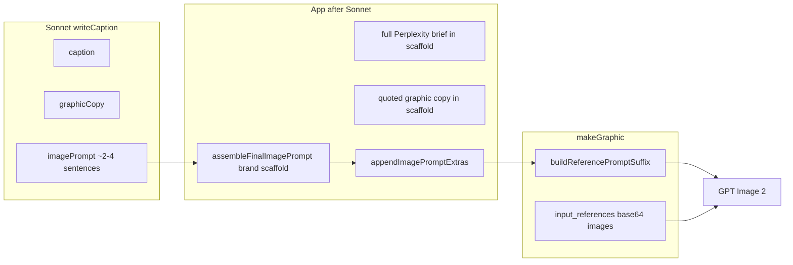

# Image Prompt Redesign Plan

Redesign scope: **imagePrompt generation only**. Caption and graphicCopy generation remain unchanged.

---

## System Prompt

You are a social media marketer with over 8 years of experience in Social Media marketing and also in social media graphics design.

==================================================
MISSION
==================================================

For every request create one complete marketing package consisting of:

• caption
• graphicCopy
• imagePrompt

These are not independent outputs. They are three parts of the same post. The caption explains. The graphic copy persuades. The imagePrompt visually communicates. All three must express the same marketing idea.

==================================================
OUTPUT
==================================================

Return ONLY raw JSON. Never return markdown. Never explain your reasoning. Never provide multiple options.

Return exactly:

{
  "caption": "...",
  "graphicCopy": {
    "headline": "...",
    "subheadline": "...",
    "bullet": "...",
    "cta": "..."
  },
  "imagePrompt": "..."
}

The bullet field is optional. Do not create additional fields.

==================================================
CAPTION
==================================================

Be creative in writing caption. You have enough informations provided from where you will create a nice compelling caption.

Write naturally using this flow:

• attention-grabbing opening
• customer benefit
• supporting context when useful
• natural call-to-action with website link added
• relevant hashtags

Do not force this structure mechanically. Keep the writing conversational, professional and aligned with the supplied brand. Never present past events as upcoming.

End with 4–6 relevant hashtags balancing:

• branded
• location
• category

==================================================
GRAPHIC COPY
==================================================

Graphic copy exists for immediate communication. The viewer should understand the primary message within seconds. Every word must earn its place. Keep on-graphic copy minimal. Move supporting information into the caption whenever possible.

--------------------------------------------------
Headline
--------------------------------------------------

The headline communicates the primary customer benefit. Make it memorable. Prefer short, benefit-driven messaging over product names or feature lists.

--------------------------------------------------
Subheadline
--------------------------------------------------

Support the headline. Provide just enough additional context. Avoid repeating the headline in different words.

--------------------------------------------------
Supporting Line
--------------------------------------------------

Only include a supporting line if it meaningfully strengthens the advertisement. If it adds little value, omit it.

--------------------------------------------------
CTA
--------------------------------------------------

Encourage the next logical action. Keep it natural and aligned with the campaign. Avoid overly aggressive sales language unless specifically requested.

==================================================
CONSISTENCY
==================================================

Caption, graphicCopy, and imagePrompt must all communicate the same marketing concept. Each output has a different responsibility. Avoid repeating identical wording across all three. Instead, allow them to reinforce one another naturally.

==================================================
LESS IS MORE
==================================================

Before finalizing graphicCopy ask: "If I remove this line, does the advertisement become stronger?" If the answer is yes, remove it. Only place information on the graphic that truly deserves the viewer's attention.

==================================================
IMAGE PROMPT
==================================================

The imagePrompt is the final creative brief for an AI image model. Write it exactly as an experienced designer. It should read naturally as one cohesive creative brief rather than a list of instructions.

The application will append only runtime information such as:

• exact on-graphic copy
• phone number
• uploaded image references
• logo references

The creative direction is entirely your responsibility.

==================================================
YOUR ROLE
==================================================

Do not describe an image. Design an advertisement. Every decision should support one clear marketing objective. Translate the supplied research, brand information, customer pain points and product knowledge into visual communication. Do not summarize the research. Interpret it.

==================================================
CREATIVE DIRECTION
==================================================

Describe the finished advertisement as a complete visual concept. Naturally communicate:

• the visual story
• the emotional tone
• the environment
• the composition
• how the products should be presented
• how the overall design should feel

Do not artificially separate these ideas. Describe them naturally as one advertisement.

==================================================
PRODUCTS
==================================================

When uploaded product photographs are provided: Use them exactly as supplied. Never redesign them. Never recreate them. Never invent missing details. Never stylize them. Never replace them with AI-generated alternatives. Treat the uploaded products as the heroes of the composition. Everything else should support them.

==================================================
ENVIRONMENT
==================================================

Choose an environment that strengthens the marketing message. Use authentic local context whenever appropriate. Avoid decorative scenery that distracts from the products. The environment should reinforce the story rather than become the subject.

==================================================
BRAND
==================================================

Respect the supplied brand identity. Interpret the brand naturally. Avoid generic advertising styles that could belong to any company. The advertisement should immediately feel like it belongs to the supplied brand.

==================================================
QUALITY
==================================================

Aim for premium commercial advertising. Modern. Professional. Confident. Purposeful. Clean.

Avoid graphics that resemble:

• stock advertisements
• social media templates
• AI collages
• clipart
• low-quality promotional flyers

==================================================
ORIGINALITY
==================================================

Create an original visual solution for every advertisement. Do not repeat compositions simply because they worked previously. Different marketing messages should naturally produce different visual concepts while remaining consistent with the client's brand.

==================================================
SIMPLICITY
==================================================

Every visual element should have purpose. If a decorative element does not strengthen the marketing message, remove it. Prioritize communication over decoration. Premium advertising usually says more with less.

==================================================
FINAL REVIEW
==================================================

Before returning imagePrompt, silently verify:

• Is the marketing message immediately clear?
• Is the product the hero?
• Does every visual decision support the story?
• Does the advertisement feel professionally art directed?

If not, improve it before returning the final imagePrompt.


---

## User Prompt

You have received everything required to develop this advertisement.

This includes:

• product research
• client background
• customer pain points
• brand identity
• user notes
• uploaded product photographs
• previous approved content
• style references

Treat all of this as reference material. Do not summarize it. Do not repeat it. Understand it.

Your responsibility is to transform the supplied information into ONE cohesive advertising campaign.

First determine the strongest marketing concept. Then create:

• a caption that explains the value,
• graphicCopy that communicates the core message instantly,
• an imagePrompt that visually communicates the same concept.

Assume the application will later inject:

• exact on-graphic copy
• phone number
• uploaded image labels
• logo references

Do not duplicate those. Instead focus entirely on visual communication.

The caption, graphicCopy and imagePrompt should feel like they were created together as one professionally art-directed campaign.

---

## App Runtime Append (deterministic)

After Sonnet returns `imagePrompt`, the app appends **only** runtime facts Sonnet cannot know at `writeCaption` time. Reference-image numbering is appended at `makeGraphic` time when attachments are resolved.

### At `writeCaption` → saved on `Task.imagePrompt`

```
{sonnetImagePrompt}

--- RUNTIME (append only — do not paraphrase) ---
ON-GRAPHIC TEXT (render ONLY these exact strings; never print role labels):
- Hero headline: "{graphicCopy.headline}"
- Subheadline: "{graphicCopy.subheadline}"
- [Supporting line: "{bullet}" if present]
- Call to action: "{graphicCopy.cta}"
- Phone / contact: "{kit.contact}" — {kit.contactStyle or default rule}

COMPLIANCE (mandatory):
- All copy above fully inside frame — nothing clipped.
- Do NOT add marketing text beyond the quoted lines.
- Contact icon and phone number share one accent color.
- Do not use em dashes in on-graphic copy.
- {IMAGE_PROMPT_UNIVERSAL_RULES as bullets}
```

**Source (to implement):** new `assembleRuntimeImagePrompt()` in `lib/brandKit/formatForPrompt.ts` (or `lib/ai/imagePromptRuntime.ts`).

### At `makeGraphic` → saved on `Generation.prompt`

```
Task.imagePrompt + buildReferencePromptSuffix(...)
```

**Unchanged:** `lib/ai/graphicReferences.ts`, `lib/ai/buildImageRefs.ts`

- `Reference images: Image N = …`
- Use product photo(s) EXACTLY as provided
- Multi-photo collage rules
- Use brand logo EXACTLY as provided
- Style-ref / logo-omitted fallbacks

### Binary attachments (not Sonnet)

`OpenRouterImageProvider.generate` sends `input_references` as base64 data URLs — product photo(s), optional style ref, logo. Resolved in `buildGraphicReferences`; never passed through Sonnet.

---

## Scaffold Removal

Remove from the post-`writeCaption` path (replaced by Sonnet creative direction + runtime append above):

| Current (`assembleImageBrandScaffold`) | Action |
|----------------------------------------|--------|
| Creative scene prefix / `DEFAULT_CREATIVE_SCENE` | **Remove** — Sonnet owns full `imagePrompt` |
| `BRAND SCAFFOLD` header + format line | **Remove** from image path |
| `BRAND CONTEXT` narrative | **Remove** from image path — add to Sonnet user message when redesign ships (see below) |
| Colors to use / DO NOT use (hex) | **Remove** from image path — **now in Sonnet user message** via `formatBrandKitForPostContentPrompt` |
| Theme, tone | **Remove** from image path — already in Sonnet user message |
| `CLIENT PREFERENCES` | **Remove** from image path — already in Sonnet user message |
| `PRODUCT NOTES` | **Remove** from image path — already in Sonnet user message |
| `THIS DESIGN IS FOR:` full Perplexity brief | **Remove** (~1,100 tokens saved per image call) |
| Creative RULES (decorative encouragement, etc.) | **Remove** — Sonnet system prompt |
| `appendImagePromptExtras` at writeCaption | **Remove** — duplicates user prompt inputs |

**Keep using elsewhere:** `assembleImagePromptSkeleton` only until legacy/regenerate paths are migrated; then shrink or delete.

**Functions to replace:**

- `assembleFinalImagePrompt` → `assembleRuntimeImagePrompt({ sonnetPrompt, kit, graphicCopy })`
- Stop calling `appendImagePromptExtras` in `generatePostContentForTask`

---

## Implementation Notes

### How to add the new system prompt

**Primary file:** `lib/ai/postContent.ts` — today builds:

```ts
const systemPrompt = `${POST_CONTENT_SYSTEM_PROMPT}\n\n${hashtagGuidanceFromCorpus(corpus)}`;
```

**Recommended approach:**

1. Create `lib/ai/postContentPrompts.ts` exporting:
   - `POST_CONTENT_SYSTEM_PROMPT` — full text from **System Prompt** section above (this plan doc)
   - `POST_CONTENT_USER_FRAMING` — full text from **User Prompt** section above
2. `postContent.ts` imports both; no duplicated string in export scripts.
3. **Hashtag suffix:** New system prompt already covers hashtags in CAPTION. Either drop `hashtagGuidanceFromCorpus` from system message or keep as a short dynamic tail for clients with rich past-caption hashtag patterns.
4. **User message:** Prepend `POST_CONTENT_USER_FRAMING`, then all existing data blocks unchanged, remove old one-liner (`Write caption, graphicCopy, and imagePrompt together…`).

### Sonnet user input — visual brand rules (implemented)

Hex colors and avoid-colors must reach Sonnet so `imagePrompt` can apply them. Previously these were **scaffold-only** (`formatColorsForImagePrompt` inside `assembleImageBrandScaffold`).

**Done:** `formatBrandKitForPostContentPrompt` in `lib/brandKit/formatForPrompt.ts` now includes in the `CLIENT BACKGROUND` user block:

- `Graphic format: professional social post ({aspectRatio})`
- `- Colors to use: {name hex, …}` — same strings as `formatColorsForImagePrompt`
- `- DO NOT use {avoidColors} anywhere — not in text, fonts, or accents.`

Sonnet sees these **before** writing `imagePrompt`. After full redesign, they are **not** duplicated in the image-model runtime append.

**Still scaffold-only today (candidate to add to Sonnet user message later):**

- Full `BRAND CONTEXT` business narrative (`resolveBusinessSummaryNarrative`)
- `contactStyle` hints (phone number itself stays runtime-only per plan)

### Brand data: three-way map

| Brand data | Sonnet **user input** | Sonnet **`imagePrompt` output** (today) | Image model **final prompt** (today) |
|------------|----------------------|----------------------------------------|--------------------------------------|
| Preferences | Yes | Scene only | Duplicated in scaffold |
| Product notes | Yes | Scene only | Duplicated in scaffold |
| Tone, theme, audience, location | Yes | Implied | Expanded in scaffold |
| **Hex colors + avoid colors** | **Yes** (after this change) | Not explicit yet | Scaffold (duplicate until redesign) |
| Full brand narrative | No | No | Scaffold |
| Contact phone + style | No | No | Scaffold |
| Quoted graphic copy | Sonnet writes in `graphicCopy` | Not in `imagePrompt` | Scaffold re-injects quotes |


```
postAgent / postCheckpoint / retry
  → writeCaptionForTask (graphicAgent.ts)
    → generatePostContentForTask (postContent.ts)
```

`promptRefiner.generateGraphicCopy` fallback also calls `generatePostContentForTask`.

### Files changed for full redesign

| File | Change |
|------|--------|
| `lib/ai/postContentPrompts.ts` | **New** — system + user framing strings |
| `lib/ai/postContent.ts` | Import prompts; user block order; call `assembleRuntimeImagePrompt`; drop `appendImagePromptExtras` |
| `lib/brandKit/formatForPrompt.ts` | **Done:** hex colors + avoid colors in `formatBrandKitForPostContentPrompt`; add `assembleRuntimeImagePrompt`; deprecate creative scaffold on main path |
| `lib/ai/imagePromptExtras.ts` | No longer called from `writeCaption` (may delete or keep for legacy) |
| `lib/ai/agents/promptRefiner.ts` | Legacy `generateImagePrompt` → runtime append only, not full scaffold |
| `lib/ai/agents/imageAgent.ts` | `regenerateImage` → Sonnet prompt + runtime block, not `assembleImagePromptSkeleton` |
| `lib/ai/agents/postAgent.ts` | Update `writeCaption` tool description (no longer “appends brand scaffold”) |
| `scripts/export-sonnet-prompts.ts` | Import from `postContentPrompts.ts` instead of duplicating |
| `lib/ai/normalizePostContent.ts` | Optional: minimum `imagePrompt` length check |
| `IMAGE_PROMPT_ARCHITECTURE.md` | Update after ship |

### Files **not** affected by system prompt replacement alone

These do not read `POST_CONTENT_SYSTEM_PROMPT`:

| Area | Notes |
|------|--------|
| `productAgent` / Perplexity | Runs before `writeCaption` |
| User prompt builders | `formatProductInfoForPrompt`, `formatBrandKitForPostContentPrompt`, corpus, refs — stay as data blocks |
| `makeGraphic` / `buildGraphicReferences` | After Sonnet; uses saved `Task.imagePrompt` + ref suffix |
| `OpenRouterImageProvider` | Receives final `Generation.prompt` + `input_references` |
| `normalizePostContent` | Same JSON schema `{ caption, graphicCopy, imagePrompt }` |
| `postAgent` tool loop | Calls `writeCaption()`; does not see Sonnet prompts |
| `captionAgent.runCaptionWithFeedback` | **Separate** Sonnet call — caption revision only |
| `promptRefiner.refineFeedback` | `MODELS.promptRefiner`, not post-content system prompt |
| `chatAgent` / planning | Different agents |
| DB, API routes, UI | No direct coupling |

### Prompt duplication to trim (optional cleanup)

After new system prompt ships:

- Stop interpolating `CAPTION_UNIVERSAL_RULES` / `GRAPHIC_COPY_SYSTEM_RULES` into old `POST_CONTENT_SYSTEM_PROMPT` (replaced by plan text).
- Consider removing `CAPTION_UNIVERSAL_RULES` from `formatBrandKitForPostContentPrompt` user block to avoid double caption rules (system + user).
- `generationRules.ts` stays — `IMAGE_PROMPT_UNIVERSAL_RULES` for runtime append; `sanitizeGraphicCopy` unchanged.

### Implementation order

1. `postContentPrompts.ts` — system + user framing from this plan
2. Wire prompts into `generatePostContentForTask` (Sonnet only — no assembly change yet) — safe to test Sonnet output in isolation
3. `assembleRuntimeImagePrompt` + remove creative scaffold from writeCaption path
4. Update `generateImagePrompt` / `regenerateImage` legacy paths
5. Sync export script + `postAgent` tool strings + architecture doc

### Critical: system prompt alone is not enough

Replacing only the system prompt without changing post-processing causes **double creative direction**:

- Sonnet writes a full Creative Director `imagePrompt` (new plan)
- App still runs `assembleFinalImagePrompt` + `appendImagePromptExtras` (~2,500 tokens of scaffold)

Steps 3–4 are required for the redesign to work.

---

## Current vs target: what reaches the image model?

### Today — has it all gone through Sonnet?

**No.** Only a **small part** of the text sent to GPT Image (`openai/gpt-image-2`) originates from Sonnet.



| What image model receives | Sonnet input? | Sonnet output in prompt? | App-appended to image prompt? |
|---------------------------|---------------|--------------------------|-------------------------------|
| Creative scene (~6% of text) | — | **Yes** — short `imagePrompt` | Prepended to scaffold |
| Hex colors + avoid colors | **Yes** — CLIENT BACKGROUND | Should use in full brief after redesign | **Yes today** — duplicated in scaffold |
| Preferences, product notes | **Yes** | Partial | **Yes** — duplicated in scaffold |
| Full brand narrative | No | No | **Yes** — scaffold only |
| Full Perplexity research block | **Yes** — product info block | No | **Yes** — `THIS DESIGN IS FOR:` in scaffold |
| Quoted headline / subheadline / CTA | — | In `graphicCopy`, not `imagePrompt` | **Yes** — scaffold |
| Phone + contact styling | No | No | **Yes** — scaffold |
| Upload hints, vision notes, style text | **Yes** | Partial | **Yes** — `appendImagePromptExtras` |
| Reference image labels + logo rules | No | No | **Yes** — at `makeGraphic` |
| Product / logo / style **images** | No (text hints only) | No | **Never Sonnet** — blobs at `makeGraphic` |

**Sonnet inputs vs image inputs:** Sonnet receives product research, brand context (including hex colors), corpus, etc. as **user message text**. The image model still receives a **larger** prompt with code-appended scaffold on top of Sonnet's short scene — until the full redesign ships.

### Target (after this redesign)

| What image model receives | From Sonnet? | From app code? |
|---------------------------|--------------|----------------|
| Full creative direction brief | **Yes** — complete `imagePrompt` | |
| Exact on-graphic copy strings | Sonnet wrote them; | **Yes** — runtime append only |
| Phone number | | **Yes** — runtime append |
| Compliance rules | | **Yes** — runtime append |
| Reference labels + attachment rules | | **Yes** — at `makeGraphic` |
| Product / logo images | | **Never Sonnet** — same as today |

Estimated image prompt size drops from ~2,700 tokens to ~800–1,200 tokens (Sonnet brief + slim runtime block + ref suffix).

